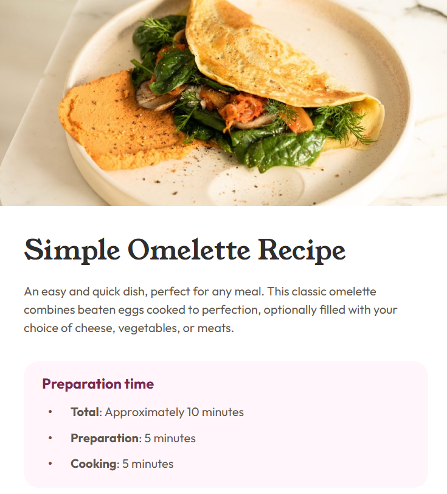

# Frontend Mentor - Recipe page solution

This is a solution to the [Recipe page challenge on Frontend Mentor](https://www.frontendmentor.io/challenges/recipe-page-KiTsR8QQKm). 

## Table of contents

- [Overview](#overview)
  - [Screenshot](#screenshot)
  - [Links](#links)
- [My process](#my-process)
  - [Built with](#built-with)
  - [What I learned](#what-i-learned)
  - [Useful resources](#useful-resources)
  - [AI Collaboration](#ai-collaboration)
- [Author](#author)

## Overview

### Screenshot



### Links

- Solution URL: https://github.com/MaxPlummer/omelette-recipe-page
- Live Site URL: https://maxplummer.github.io/omelette-recipe-page/

## My process

### Built with

- Semantic HTML5 markup
- CSS classes
- Flexbox
- CSS Grid
- Mobile-first workflow

### What I learned

I learned more about using tables with this project. I made a clean nutrition table with vertical headers and horizontal borders. I also used the the last-child pseudo class to remove the border from the last element for a more stylistic design. 
```html
<tbody>
  <tr>
    <th>Calories</th>
    <td>277kcal</td>
  </tr>
```
I also learned about counters, specifically the list-counter for creating numberical list markers for an ordered list. I ran into an issue where the default font was overriding my variable font, so I used the list-counter to place numerical markers before list items to show the correct font. 
```css
ol.instructions li::before {
  content: counter(list-counter) ".";
  font-weight: 700;
  color: hsl(14, 45%, 36%);
  position: absolute;
  margin-left: -2rem;
}
```

### Useful resources

- [W3Schools CSS Counters](https://www.w3schools.com/css/css_counters.asp) - This helped me understand counters in CSS and how to make the numbers on my list of instructions show the correct font. 

### AI Collaboration

I consulted with GitHub Copilot for this project mainly for semantic advice and debugging. I have a decent grasp of accessibility needs, but I got Copilot to check my semantics and find any weak areas. 

I also occassionally asked the AI to search for the cause of bugs if I was having trouble. 

## Author

- GitHub - [MaxPlummer](https://github.com/MaxPlummer)
- Frontend Mentor - [@MaxPlummer](https://www.frontendmentor.io/profile/MaxPlummer)
- LinkedIn - [Maxwell Plummer](https://www.linkedin.com/in/maxwell-plummer-1b2b13291/)
